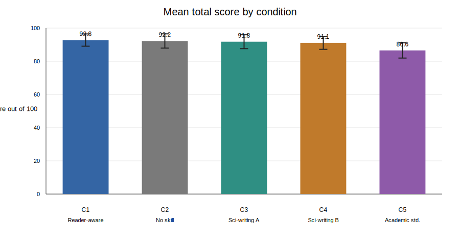
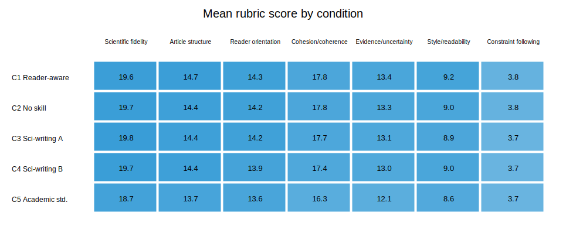
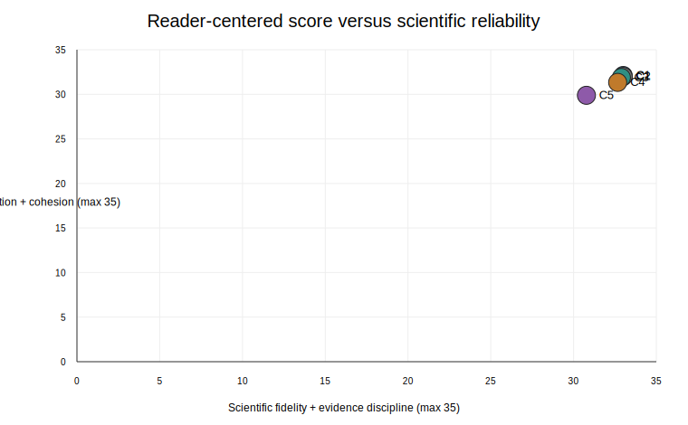
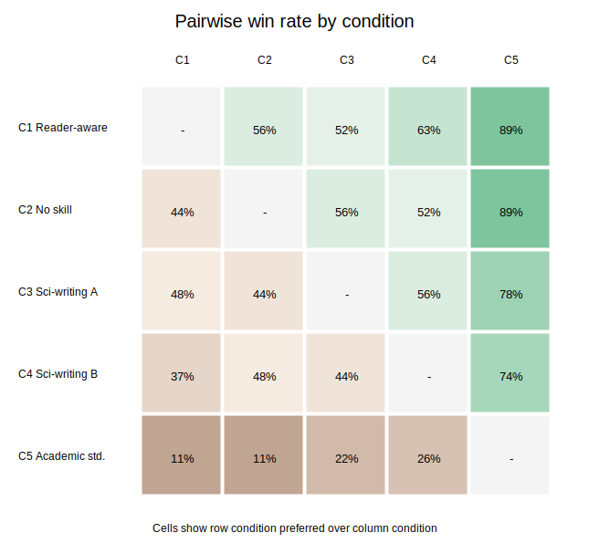

# Reader-Aware Writing Skill Benchmark

## Executive Summary

This report compares five authoring conditions on the same controlled life-science dossier.
Each condition generated three independent articles.
The articles were blinded before evaluation, and 3 independent evaluator runs scored 15 articles with a 100-point rubric.

The top mean total score was **92.8** for **C1 Reader-aware writing**.
The gap to the next condition was **0.6** points, so the result should be interpreted with the replicate and evaluator variation shown below.

## Conditions

| Condition | Skill condition |
|---|---|
| C1 | Reader-aware writing, local repository skill |
| C2 | No-skill baseline |
| C3 | Public scientific-writing representative |
| C4 | Public scientific-writing alternative |
| C5 | Academic writing standards |

## Main Score Summary

| Rank | Condition | Skill condition | N scores | Mean total | SD | Reader-centered | Reliability | Mean words |
| --- | --- | --- | --- | --- | --- | --- | --- | --- |
| 1 | C1 | Reader-aware writing | 9 | 92.8 | 3.7 | 32.1 | 33.0 | 1800.0 |
| 2 | C2 | No-skill baseline | 9 | 92.2 | 4.3 | 32.0 | 33.0 | 1804.7 |
| 3 | C3 | Scientific-writing representative | 9 | 91.8 | 4.2 | 31.9 | 32.9 | 1774.0 |
| 4 | C4 | Scientific-writing alternative | 9 | 91.1 | 3.9 | 31.3 | 32.7 | 1767.0 |
| 5 | C5 | Academic writing standards | 9 | 86.6 | 4.6 | 29.9 | 30.8 | 1774.3 |

## Rubric Profile

Reader-centered score is `reader orientation + cohesion/coherence` out of 35.
Reliability score is `scientific fidelity + evidence discipline` out of 35.

## Pairwise Preference Analysis

Pairwise win rates use evaluator pairwise preferences between articles from different conditions.
A value above 0.50 means the row condition was preferred more often than the column condition.

| Row beats column | C1 | C2 | C3 | C4 | C5 |
| --- | --- | --- | --- | --- | --- |
| C1 |  | 0.6 | 0.5 | 0.6 | 0.9 |
| C2 | 0.4 |  | 0.6 | 0.5 | 0.9 |
| C3 | 0.5 | 0.4 |  | 0.6 | 0.8 |
| C4 | 0.4 | 0.5 | 0.4 |  | 0.7 |
| C5 | 0.1 | 0.1 | 0.2 | 0.3 |  |

## Article-Level Scores

| Article | Condition | Replicate | Words | Mean total | SD |
| --- | --- | --- | --- | --- | --- |
| Article_F | C2 | R2 | 1791 | 93.7 | 2.1 |
| Article_H | C1 | R2 | 1804 | 93.7 | 4.0 |
| Article_M | C3 | R2 | 1811 | 93.7 | 5.1 |
| Article_E | C3 | R3 | 1711 | 92.7 | 4.0 |
| Article_O | C2 | R1 | 1810 | 92.7 | 3.8 |
| Article_C | C1 | R3 | 1794 | 92.3 | 4.7 |
| Article_L | C1 | R1 | 1802 | 92.3 | 3.8 |
| Article_N | C4 | R1 | 1782 | 92.0 | 2.6 |
| Article_G | C4 | R2 | 1813 | 91.3 | 3.8 |
| Article_D | C5 | R3 | 1810 | 90.3 | 5.1 |
| Article_J | C2 | R3 | 1813 | 90.3 | 6.8 |
| Article_K | C4 | R3 | 1706 | 90.0 | 6.1 |
| Article_B | C3 | R1 | 1800 | 89.0 | 3.0 |
| Article_I | C5 | R1 | 1779 | 86.7 | 3.8 |
| Article_A | C5 | R2 | 1734 | 82.7 | 0.6 |

## Methods

The source dossier was `D001_caspase5c_wnt_intestinal_homeostasis.md`, extracted from the user-supplied blinded PDF.
All authoring runs used the same model family and the same fixed writing prompt, except for the assigned skill and its isolated `CODEX_HOME`.
Each authoring condition had only its assigned user skill installed, with C2 intentionally containing no user writing skill.
System skills bundled with Codex were present but not the tested writing skills.

Articles were blinded by removing authoring metadata and assigning random `Article_*` identifiers with a fixed seed.
Evaluators received only the dossier, blinded articles, and the standard scoring rubric.
They did not receive condition names, skill names, replicate IDs, or the private blinding map.

## Limitations

This is a single-topic, single-model benchmark with three authoring replicates per condition.
The results estimate performance for this controlled scientific-writing task, not universal writing quality.
Small score gaps should be treated as directional until repeated on additional dossiers and evaluators.

## Audit Trail

- Protocol: `comparing/evaluation_protocol.md`
- Skill registry: `comparing/skill_registry.md`
- Evaluation log: `comparing/evaluation_log.md`
- Scorebook: `comparing/evaluation_results/run-2026-05-01-D001/scorebook.csv`
- Condition summary: `comparing/evaluation_results/run-2026-05-01-D001/summary_by_condition.csv`
- Private blinding map: `comparing/blinded_articles/run-2026-05-01-D001/blinding_map_private.csv`

_Rendered from `comparison_report.qmd` by `comparing/scripts/benchmark_pipeline.py`._
