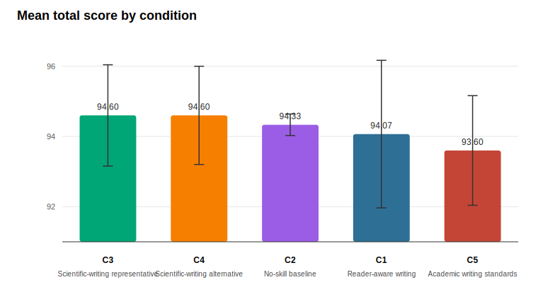
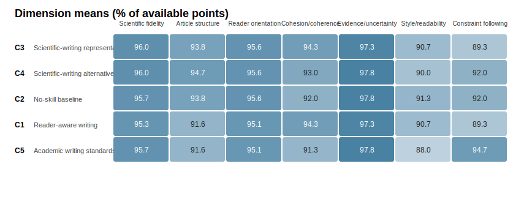
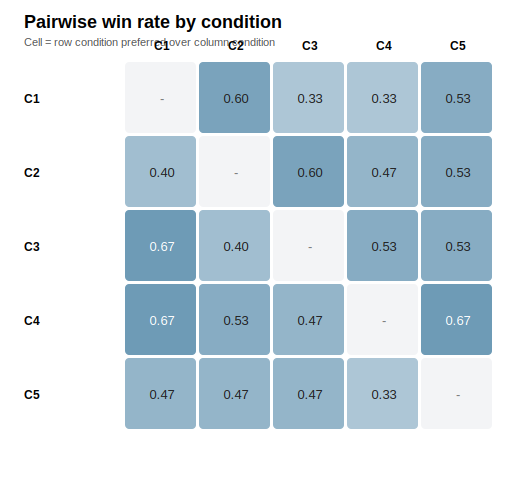
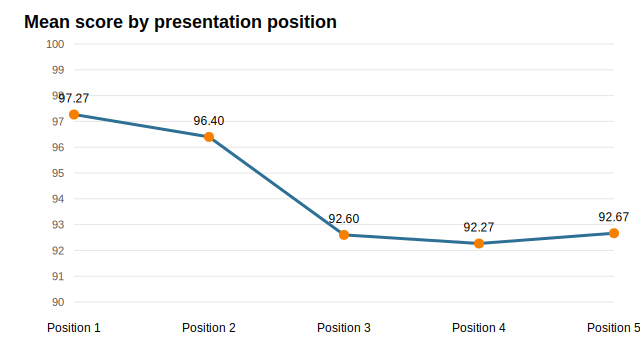

# Arrangement5-5 Scientific Writing Skill Comparison

Run ID: `run-2026-05-01-D002`  
Dossier: `D002_caspase5c_wnt_noisy_notes.md`  
Evaluation design: one blinded evaluator (`E1`) scored 15 packets: 3 replicates x 5 presentation arrangements. Each article appeared once in each position within its replicate. Neutral nicknames were decoded only after scoring.

## Executive Summary

The corrected D002 run does **not** show a decisive winner. The top condition was `C3` (Scientific-writing representative) at 94.60/100, while the focal reader-aware skill (`C1`) scored 94.07/100. The full spread across all five conditions was only 1.00 point on a 100-point rubric, smaller than the article-level standard deviations.

This means the benchmark should be read as a high-quality tie with small directional differences, not as evidence that any skill is clearly superior on this single topic.

## Primary Ranking

Scores below use article-level means as the primary unit (`n = 3` articles per condition). The repeated position scores are averaged within each article before condition-level comparison.

| Rank | Condition | Name | Mean total | Article SD | Delta vs C1 | Bootstrap CI |
| --- | --- | --- | --- | --- | --- | --- |
| 1 | C3 | Scientific-writing representative | 94.60 | 1.44 | 0.53 | [-2.00, 2.20] |
| 2 | C4 | Scientific-writing alternative | 94.60 | 1.40 | 0.53 | [0.00, 1.60] |
| 3 | C2 | No-skill baseline | 94.33 | 0.31 | 0.27 | [-1.60, 2.00] |
| 4 | C1 | Reader-aware writing | 94.07 | 2.10 | 0.00 | [0.00, 0.00] |
| 5 | C5 | Academic writing standards | 93.60 | 1.56 | -0.47 | [-1.60, 0.40] |

The bootstrap interval is descriptive only. It resamples three article-level replicate differences and should not be treated as a formal significance test.

## Dimension Profile

| Condition | Name | Scientific fidelity | Article structure | Reader orientation | Cohesion/coherence | Evidence/uncertainty | Style/readability | Constraint following |
| --- | --- | --- | --- | --- | --- | --- | --- | --- |
| C3 | Scientific-writing representative | 19.20 | 14.07 | 14.33 | 18.87 | 14.60 | 9.07 | 4.47 |
| C4 | Scientific-writing alternative | 19.20 | 14.20 | 14.33 | 18.60 | 14.67 | 9.00 | 4.60 |
| C2 | No-skill baseline | 19.13 | 14.07 | 14.33 | 18.40 | 14.67 | 9.13 | 4.60 |
| C1 | Reader-aware writing | 19.07 | 13.73 | 14.27 | 18.87 | 14.60 | 9.07 | 4.47 |
| C5 | Academic writing standards | 19.13 | 13.73 | 14.27 | 18.27 | 14.67 | 8.80 | 4.73 |

The focal skill (`C1`) was competitive on cohesion/coherence, but it did not separate itself on reader orientation in this run. The largest practical differences were small and mostly involved article structure, constraint following, and style/readability.

## Pairwise Preferences

Pairwise scores add a useful check because they do not always match total-score ordering. `C1` beat `C2` in pairwise comparisons despite scoring slightly lower by total mean, but lost to `C3` and `C4`.

| Condition | C1 | C2 | C3 | C4 | C5 |
| --- | --- | --- | --- | --- | --- |
| C1 |  | 0.6 | 0.333 | 0.333 | 0.533 |
| C2 | 0.4 |  | 0.6 | 0.467 | 0.533 |
| C3 | 0.667 | 0.4 |  | 0.533 | 0.533 |
| C4 | 0.667 | 0.533 | 0.467 |  | 0.667 |
| C5 | 0.467 | 0.467 | 0.467 | 0.333 |  |

## Position Check

| Position | Mean total | Score rows |
| --- | --- | --- |
| 1 | 97.27 | 15 |
| 2 | 96.40 | 15 |
| 3 | 92.60 | 15 |
| 4 | 92.27 | 15 |
| 5 | 92.67 | 15 |

The decoder verified exact position balance: every condition appeared three times in each of the five presentation positions, and each article was scored once in every position. The position means nevertheless show a strong absolute-score position effect, with early positions scored higher. Arrangement5-5 should therefore be retained for future runs; a single fixed or random order would be much less reliable.

## Interpretation

The main conclusion is methodological: the revised dossier and Arrangement5-5 scoring removed the earlier obvious no-skill advantage, but the evaluator still scored all conditions very closely. This suggests the current test is measuring the model's ability to synthesize a constrained scientific dossier more than it is isolating the value of the reader-aware skill.

For the focal skill, the result is still useful. `C1` remained in the same narrow performance band as the strongest public scientific-writing comparators and the no-skill baseline, but it did not produce a measurable advantage under this single-topic design. A stronger next benchmark should use multiple papers, more diverse article genres, and evaluation dimensions that more directly stress reader-path construction, paragraph logic, and repair of noisy or poorly ordered source material.

## Audit Notes

- Authoring used `writing-subagent-v2-minimal`, which did not ask submodels to improve quality beyond following their assigned skill.
- The dossier was deliberately noisy and less systematically organized.
- Evaluation used neutral nicknames and private decoding maps to avoid condition labels.
- An initial sequential evaluator attempt was superseded because later packets could see earlier raw evaluation files in the repository. The final reported results come from `run_arrangement55_evaluation_packets.py`, which runs each packet in a fresh temporary work directory and copies only the completed outputs back into the repository.
- `decode_arrangement55_scores.py` passed schema, leakage, pairwise coverage, and position-balance checks.
