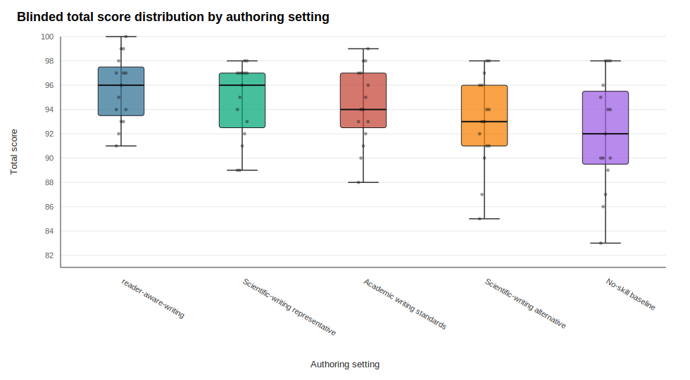
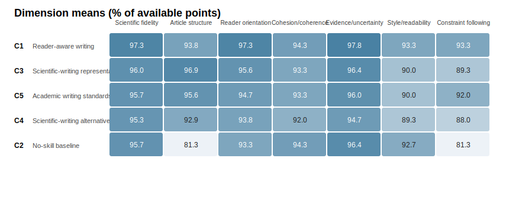
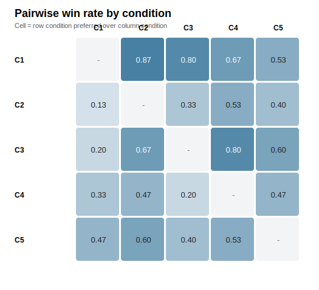
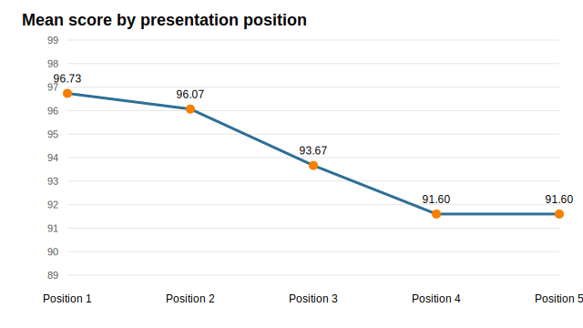

# Arrangement5-5 Scientific Writing Skill Comparison

Run ID: `run-2026-05-01-D003`  
Dossier: `D002_caspase5c_wnt_noisy_notes.md`  
Source article: Jia, B., Shi, Y., Hong, Y. et al. Caspase 5c amplifies Wnt via APC cleavage to promote intestinal homeostasis. Nature 652, 1362-1374 (2026). https://doi.org/10.1038/s41586-026-10343-8

Evaluation design: one blinded evaluator (`E1`) scored 15 packets: 3 replicates x 5 presentation arrangements. Each article appeared once in each position within its replicate. Neutral nicknames were decoded only after scoring.

## Executive Summary

The revised focal reader-aware skill (`C1`) had the top mean total score at 95.67/100. The full spread across all five conditions was 3.67 point on a 100-point rubric.

Small score gaps should be read as directional because this is still a single-topic benchmark with three authoring replicates per condition.

*Figure 1. Blinded total-score distribution by authoring setting. Each dot is one total score for one generated article in one of the five presentation positions (`15` scores per condition: 3 articles x 5 positions). Boxes show the interquartile range, the center line is the median, and whiskers show the observed minimum and maximum. Conditions are ordered by article-level mean total score, which is the primary ranking unit after averaging each article across all five positions. Because the Arrangement5-5 design makes every article appear once in every position, the plot shows the score distribution used for ranking while preventing any condition from benefiting from a systematically earlier or later presentation slot.*

## Evaluation Design and Records

### Comparable Skills and Snapshots

The benchmark compared the focal skill against a no-skill control and three public writing-skill comparators. Each authoring condition ran in an isolated `CODEX_HOME` containing only the assigned user skill, and each snapshot was recorded before authoring began.

| Condition | Role | GitHub / Source Link | Snapshot or Download UTC | Recorded Version |
| --- | --- | --- | --- | --- |
| C1 | Reader-aware writing | [xchuam/Reader-Aware-Writing](https://github.com/xchuam/Reader-Aware-Writing/tree/97c06ad26991c68060a4094b6fbd63cb5ed4a671/skills/reader-aware-writing) | `2026-05-01T12:17:30Z` | Working tree at git head `97c06ad26991c68060a4094b6fbd63cb5ed4a671`; skill tree SHA-256 `b3ade6b38356ddf5fe16b139a8ee13d371e1017e789e2aa39feac5031d352f65`. |
| C2 | No-skill baseline | N/A | N/A | Fresh isolated `CODEX_HOME` with no user writing skill installed. |
| C3 | Scientific-writing representative | Listed GitHub repository [smithery/ai](https://github.com/smithery/ai); rendered source page [skills.sh/smithery/ai/scientific-writing](https://skills.sh/smithery/ai/scientific-writing) | `2026-05-01T09:52:19Z` | The listed GitHub repository was not reachable by `git ls-remote`, so the rendered `SKILL.md` was snapshotted; tree SHA-256 `cf4c35607ffc8f5e1c57b447f201b941ce1597fb26ff69aa36821dbab1726332`. |
| C4 | Scientific-writing alternative | [ovachiever/droid-tings scientific-writing](https://github.com/ovachiever/droid-tings/tree/7acd12a7547ded8f801615e69c3b881a584ce323/skills/scientific-writing) | `2026-05-01T09:52:19Z` | Snapshot from commit `7acd12a7547ded8f801615e69c3b881a584ce323`; tree SHA-256 `faac0c616485479b7b0c9698541b17f6e82c0d6f10842849f7c1e5113d095b7a`. |
| C5 | Academic writing standards | [seabbs/skills academic-writing-standards](https://github.com/seabbs/skills/tree/006088dd99868765db0847d068b5089c192086b5/plugins/research-academic/skills/academic-writing-standards) | `2026-05-01T09:52:19Z` | Snapshot from commit `006088dd99868765db0847d068b5089c192086b5`; tree SHA-256 `0b92cea6eef9b58fa57ee01f5cc72605f43e55d1404c2b95eadcdd38b17728f7`. |

### Dossier Construction and Access Control

The D002 dossier was designed to test whether a writing skill can build a readable scientific article from imperfect source notes rather than from a polished outline. The source was a very recent 2026 Nature article; benchmark agents were not given a preprint, an open-access manuscript, the source PDF, web access, or external search. They received only the fixed dossier text embedded in the prompt.

The dossier was created by extracting study information from the source article and then adding controlled source-note noise: disordered facts, repetition, rough wording, typos, grammar errors, and confusing transitions. It also preserved caveats and prohibited-claim notes so the evaluator could penalize unsupported upgrades such as treating CASP5C as a proven disease cause or validated therapeutic target. Evaluation treated the dossier, not agent memory or outside literature, as the source of truth.

### Blinding, Position Balance, and Decoding

Before evaluation, condition labels, skill names, model metadata, source filenames, and replicate IDs were removed from the article packets and replaced with neutral nicknames. The private maps were decoded only after scoring.

This position control is necessary because LLM judges can show order effects. Wang et al. (2024), [Large Language Models are not Fair Evaluators](https://aclanthology.org/2024.acl-long.511/) reported that simply changing candidate-response order can alter quality rankings, and proposed balanced-position calibration as one mitigation. Arrangement5-5 applies the same principle to five candidate articles: for each replicate, five Latin-square packets rotate the five articles so every condition appears exactly once in each presentation position. The decoder then verifies row counts, leakage patterns, pairwise coverage, nickname membership, and exact position balance before condition means are reported.

## Primary Ranking

Scores below use article-level means as the primary unit (`n = 3` articles per condition). The repeated position scores are averaged within each article before condition-level comparison.

| Rank | Condition | Name | Mean total | Article SD | Delta vs C1 | Bootstrap CI |
| --- | --- | --- | --- | --- | --- | --- |
| 1 | C1 | Reader-aware writing | 95.67 | 1.29 | 0.00 | [0.00, 0.00] |
| 2 | C3 | Scientific-writing representative | 94.67 | 0.90 | -1.00 | [-2.00, -0.40] |
| 3 | C5 | Academic writing standards | 94.33 | 2.14 | -1.33 | [-2.20, -0.40] |
| 4 | C4 | Scientific-writing alternative | 93.00 | 1.71 | -2.67 | [-5.20, -1.40] |
| 5 | C2 | No-skill baseline | 92.00 | 1.11 | -3.67 | [-5.80, -1.20] |

The bootstrap interval is descriptive only. It resamples three article-level replicate differences and should not be treated as a formal significance test.

## Dimension Profile

| Condition | Name | Scientific fidelity | Article structure | Reader orientation | Cohesion/coherence | Evidence/uncertainty | Style/readability | Constraint following |
| --- | --- | --- | --- | --- | --- | --- | --- | --- |
| C1 | Reader-aware writing | 19.47 | 14.07 | 14.60 | 18.87 | 14.67 | 9.33 | 4.67 |
| C3 | Scientific-writing representative | 19.20 | 14.53 | 14.33 | 18.67 | 14.47 | 9.00 | 4.47 |
| C5 | Academic writing standards | 19.13 | 14.33 | 14.20 | 18.67 | 14.40 | 9.00 | 4.60 |
| C4 | Scientific-writing alternative | 19.07 | 13.93 | 14.07 | 18.40 | 14.20 | 8.93 | 4.40 |
| C2 | No-skill baseline | 19.13 | 12.20 | 14.00 | 18.87 | 14.47 | 9.27 | 4.07 |

The dimension profile is the main diagnostic view for the skill revision. Reader orientation and cohesion/coherence are the target dimensions; article structure, evidence discipline, and constraint following show whether the skill improved reader-aware behavior without losing scientific control.

In this run, `C1` scored 14.60/15 on reader orientation (best score: 14.60/15) and 18.87/20 on cohesion/coherence (best score: 18.87/20). Against the no-skill baseline, `C1` gained 0.60 points on the combined target dimensions and 3.67 points in total score.

## Pairwise Preferences

Pairwise scores add a useful check because they do not always match total-score ordering.

| Condition | C1 | C2 | C3 | C4 | C5 |
| --- | --- | --- | --- | --- | --- |
| C1 |  | 0.867 | 0.8 | 0.667 | 0.533 |
| C2 | 0.133 |  | 0.333 | 0.533 | 0.4 |
| C3 | 0.2 | 0.667 |  | 0.8 | 0.6 |
| C4 | 0.333 | 0.467 | 0.2 |  | 0.467 |
| C5 | 0.467 | 0.6 | 0.4 | 0.533 |  |

## Position Check

| Position | Mean total | Score rows |
| --- | --- | --- |
| 1 | 96.73 | 15 |
| 2 | 96.07 | 15 |
| 3 | 93.67 | 15 |
| 4 | 91.60 | 15 |
| 5 | 91.60 | 15 |

The decoder verified exact position balance: every condition appeared three times in each of the five presentation positions, and each article was scored once in every position. The position means nevertheless show a strong absolute-score position effect, with early positions scored higher. This is why the balanced design matters: early-position generosity is averaged across all conditions instead of being attached to one skill. Arrangement5-5 should therefore be retained for future runs; a single fixed or merely random order would be much less reliable.

## Interpretation

The main conclusion should be read together with the position-balanced design and the narrow score spread. The revised `C1` skill moved to first overall and showed its clearest target-dimension gain on reader orientation, while cohesion/coherence remained a tie with the no-skill baseline. This supports the revision direction but also shows the next iteration should make paragraph-to-paragraph progression even more visible in the final article.

A stronger next benchmark should use multiple papers, more diverse article genres, and evaluation dimensions that more directly stress reader-path construction, paragraph logic, and repair of noisy or poorly ordered source material.

## Audit Notes

- Comparator skill sources, snapshot times, and recorded hashes are listed in the report and in `comparing/skill_registry.md`.
- The dossier used a recent article that authoring and evaluation agents could not independently access during the run; they received only extracted noisy notes with deliberate surface errors and caveat traps.
- Authoring used `writing-subagent-v2-minimal`, which did not ask submodels to improve quality beyond following their assigned skill.
- The dossier was deliberately noisy and less systematically organized.
- Evaluation used neutral nicknames and private decoding maps to avoid condition labels.
- An initial sequential evaluator attempt was superseded because later packets could see earlier raw evaluation files in the repository. The final reported results come from `run_arrangement55_evaluation_packets.py`, which runs each packet in a fresh temporary work directory and copies only the completed outputs back into the repository.
- `decode_arrangement55_scores.py` passed schema, leakage, pairwise coverage, and position-balance checks.
