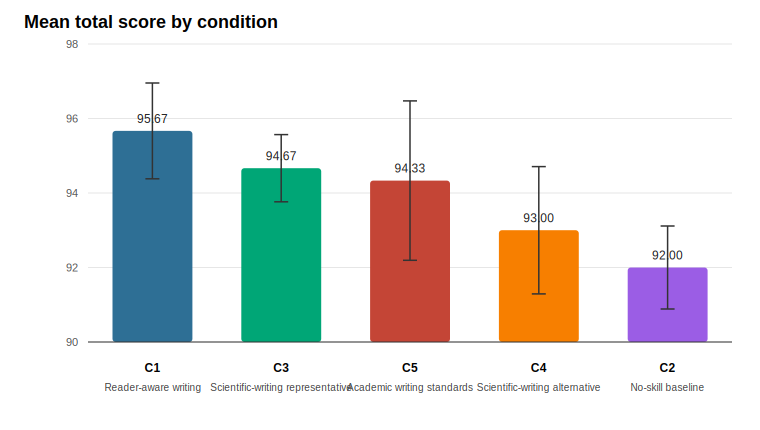

# Arrangement5-5 Scientific Writing Skill Comparison

Run ID: `run-2026-05-01-D003`  
Dossier: `D002_caspase5c_wnt_noisy_notes.md`  
Evaluation design: one blinded evaluator (`E1`) scored 15 packets: 3 replicates x 5 presentation arrangements. Each article appeared once in each position within its replicate. Neutral nicknames were decoded only after scoring.

## Executive Summary

The revised focal reader-aware skill (`C1`) had the top mean total score at 95.67/100. The full spread across all five conditions was 3.67 point on a 100-point rubric.

Small score gaps should be read as directional because this is still a single-topic benchmark with three authoring replicates per condition.

## Primary Ranking

Scores below use article-level means as the primary unit (`n = 3` articles per condition). The repeated position scores are averaged within each article before condition-level comparison.

| Rank | Condition | Name | Mean total | Article SD | Delta vs C1 | Bootstrap CI |
| --- | --- | --- | --- | --- | --- | --- |
| 1 | C1 | Reader-aware writing | 95.67 | 1.29 | 0.00 | [0.00, 0.00] |
| 2 | C3 | Scientific-writing representative | 94.67 | 0.90 | -1.00 | [-2.00, -0.40] |
| 3 | C5 | Academic writing standards | 94.33 | 2.14 | -1.33 | [-2.20, -0.40] |
| 4 | C4 | Scientific-writing alternative | 93.00 | 1.71 | -2.67 | [-5.20, -1.40] |
| 5 | C2 | No-skill baseline | 92.00 | 1.11 | -3.67 | [-5.80, -1.20] |

The bootstrap interval is descriptive only. It resamples three article-level replicate differences and should not be treated as a formal significance test.

## Dimension Profile

| Condition | Name | Scientific fidelity | Article structure | Reader orientation | Cohesion/coherence | Evidence/uncertainty | Style/readability | Constraint following |
| --- | --- | --- | --- | --- | --- | --- | --- | --- |
| C1 | Reader-aware writing | 19.47 | 14.07 | 14.60 | 18.87 | 14.67 | 9.33 | 4.67 |
| C3 | Scientific-writing representative | 19.20 | 14.53 | 14.33 | 18.67 | 14.47 | 9.00 | 4.47 |
| C5 | Academic writing standards | 19.13 | 14.33 | 14.20 | 18.67 | 14.40 | 9.00 | 4.60 |
| C4 | Scientific-writing alternative | 19.07 | 13.93 | 14.07 | 18.40 | 14.20 | 8.93 | 4.40 |
| C2 | No-skill baseline | 19.13 | 12.20 | 14.00 | 18.87 | 14.47 | 9.27 | 4.07 |

The dimension profile is the main diagnostic view for the skill revision. Reader orientation and cohesion/coherence are the target dimensions; article structure, evidence discipline, and constraint following show whether the skill improved reader-aware behavior without losing scientific control.

In this run, `C1` scored 14.60/15 on reader orientation (best score: 14.60/15) and 18.87/20 on cohesion/coherence (best score: 18.87/20). Against the no-skill baseline, `C1` gained 0.60 points on the combined target dimensions and 3.67 points in total score.

## Pairwise Preferences

Pairwise scores add a useful check because they do not always match total-score ordering.

| Condition | C1 | C2 | C3 | C4 | C5 |
| --- | --- | --- | --- | --- | --- |
| C1 |  | 0.867 | 0.8 | 0.667 | 0.533 |
| C2 | 0.133 |  | 0.333 | 0.533 | 0.4 |
| C3 | 0.2 | 0.667 |  | 0.8 | 0.6 |
| C4 | 0.333 | 0.467 | 0.2 |  | 0.467 |
| C5 | 0.467 | 0.6 | 0.4 | 0.533 |  |

## Position Check

| Position | Mean total | Score rows |
| --- | --- | --- |
| 1 | 96.73 | 15 |
| 2 | 96.07 | 15 |
| 3 | 93.67 | 15 |
| 4 | 91.60 | 15 |
| 5 | 91.60 | 15 |

The decoder verified exact position balance: every condition appeared three times in each of the five presentation positions, and each article was scored once in every position. The position means nevertheless show a strong absolute-score position effect, with early positions scored higher. Arrangement5-5 should therefore be retained for future runs; a single fixed or random order would be much less reliable.

## Interpretation

The main conclusion should be read together with the position-balanced design and the narrow score spread. The revised `C1` skill moved to first overall and showed its clearest target-dimension gain on reader orientation, while cohesion/coherence remained a tie with the no-skill baseline. This supports the revision direction but also shows the next iteration should make paragraph-to-paragraph progression even more visible in the final article.

A stronger next benchmark should use multiple papers, more diverse article genres, and evaluation dimensions that more directly stress reader-path construction, paragraph logic, and repair of noisy or poorly ordered source material.

## Audit Notes

- Authoring used `writing-subagent-v2-minimal`, which did not ask submodels to improve quality beyond following their assigned skill.
- The dossier was deliberately noisy and less systematically organized.
- Evaluation used neutral nicknames and private decoding maps to avoid condition labels.
- An initial sequential evaluator attempt was superseded because later packets could see earlier raw evaluation files in the repository. The final reported results come from `run_arrangement55_evaluation_packets.py`, which runs each packet in a fresh temporary work directory and copies only the completed outputs back into the repository.
- `decode_arrangement55_scores.py` passed schema, leakage, pairwise coverage, and position-balance checks.
